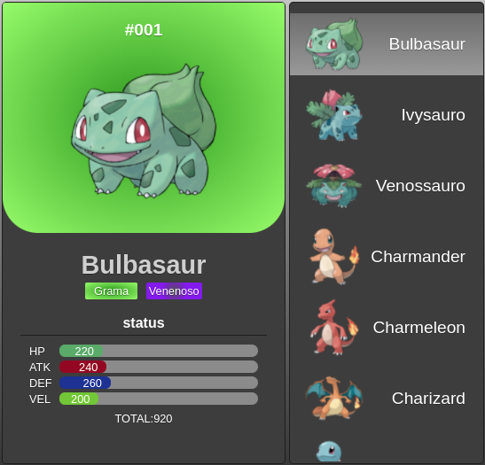

<p>
  
  
  <a href="https://github.com/marlondlacerda/pokedex/commits/main">
    
  </a>
</p>

<!-- ALL-CONTRIBUTORS-BADGE:START - Do not remove or modify this section -->
<!-- ALL-CONTRIBUTORS-BADGE:END -->


## Tópicos 

[Preview](#preview)

[Sobre o Trybe Recipes](#sobre-o-trybe-recipes)

[Tecnologias](#tecnologias)

[Instalação e uso](#instalação-e-uso)

<br>

## Preview

<a title="Pokedex" href="https://marlondlacerda.github.io/Pokedex/" >Clique aqui </a> para ter acesso a um  preview do App. <br>

## Sobre o Trybe Recipes 

O Pokedex é um dos projetos desenvolvido em grupo junto com o [Wan](https://github.com/wanlucas), [Pedro H. Niemczewski](https://github.com/PedroHasseDev), [Rafael França](https://github.com/rafaelftourinho), [Luis Arthur](https://github.com/luisArthurRodriguesDaSilva) & [Marlon Lacerda](https://github.com/marlondlacerda). Foram 10 dias de projeto, que envolveu reuniões diárias, utilização de metodologias ágeis e também desenvolvimento em pair programming.

Ele é um app para exibir e poder selecionar uma lista contendo os 150 primeiros pokemons.
Os dados são cosumidos de uma api própria desenvolvida por nós.

<br>

<p align="center">
  

</p>

## Tecnologias

Tecnologias e ferramentas utilizadas no desenvolvimento do projeto:

- [VS Code](https://code.visualstudio.com/) com [ESLint](https://eslint.org/)

<br>

## Instalação e uso

```bash
# Abra um terminal e copie este repositório com o comando
git clone git@github.com:marlondlacerda/Pokedex.git
# ou use a opção de download.

# Entre na pasta web com 
cd Pokedex

# Instale as dependências
yarn install
ou 
npm install

# Rode o aplicação
usando extensão Live Server no vs-code

# Acesse http://127.0.0.1:5500/index.html no seu navagador.
```

<br>

Esse projeto está sob a licença MIT. Veja o arquivo [LICENSE](/LICENSE) para mais detalhes.

---

## Contributors ✨

Thanks goes to these wonderful people ([emoji key](https://allcontributors.org/docs/en/emoji-key)):

<!-- ALL-CONTRIBUTORS-LIST:START - Do not remove or modify this section -->
<!-- prettier-ignore-start -->
<!-- markdownlint-disable -->
<!-- markdownlint-restore -->
<!-- prettier-ignore-end -->

<!-- ALL-CONTRIBUTORS-LIST:END -->

This project follows the [all-contributors](https://github.com/all-contributors/all-contributors) specification. Contributions of any kind welcome!
